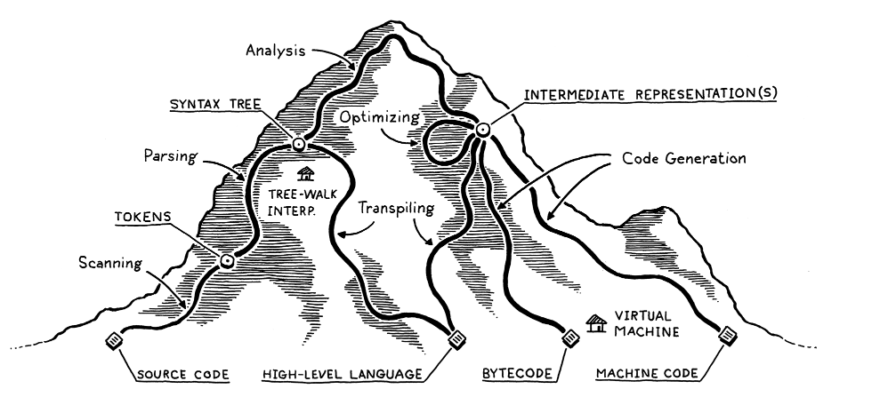

# Work log for jfila

Map for language design:

Steps for language interpreting:

1. Scanning

   > Take a linear stream of characters and break them into `tokens`. (token examples are : `{`, `}`, string literals("69")).

   > 

2. Parsing

   > Give grammar to our syntax. Basically, take a flat sequence of tokens and build a `syntax tree` or `abstract syntax tree`(sounds more cooler).

   > 

3.
